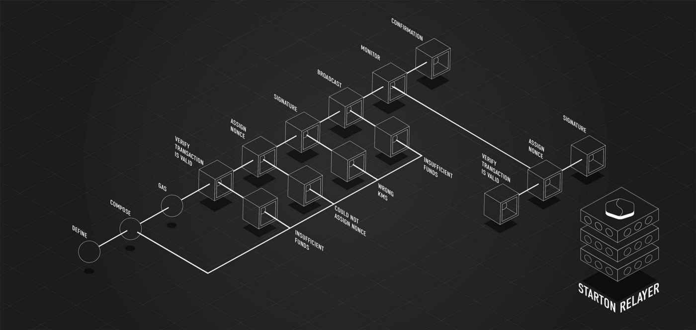
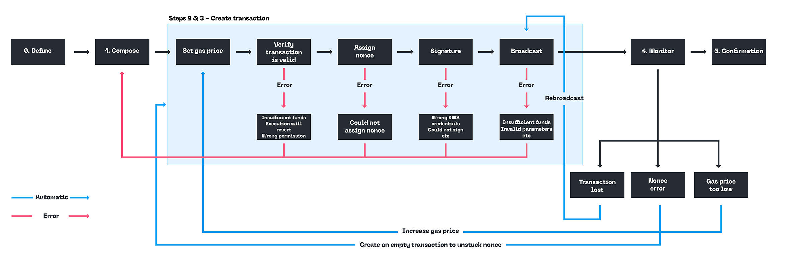

#Blockchain transaction lifecycle

## Introduction
The Relayer is the heart of Starton regarding pre-chain management*. It allows you to send a large number of transactions with peace of mind and handles all the complexity, assuring that your transactions will be on-chain as soon as possible. But the blockchain is complex and sometimes you can encounter problems such as:

- Lost transaction
- Nonce issue
- Gas price management
- Automatic signature
- Real-time status of your transaction

The Relayer’s role is to handle these errors when possible and otherwise to inform users of the transaction status so they can take action. Let’s follow a transaction step-by-step, from creation to publication on the blockchain, from Starton’s point of view for you to understand the power of our relayer.

## Step 0 — Define
First, users have to define what they want to do. This can be tricky for newcomers as so many possibilities and use cases exist. Should I use ERC721? ERC1155? ERC20? Or even a simple transaction?

All along this article, we will explore a use case using an accessible example so that you get a better understanding.

Issues you can face:
- Trouble expressing your use case
- Answer this simple question: “Is blockchain suitable for my use case?”
- Decide which type of smart contract I should use for my use case
- Starton helps you by providing:
- A list of use case examples
- A set of documentation
- A discord server to help you
Example:
To illustrate how the Relayer works, let’s take a concrete example. As a community manager, you want to reward your community. You decide to give them NFTs reflecting their engagement. You want to mint (create) 10k different NFTs and offer them to your community. For this use case, you choose to deploy an ERC721 template.

## Step 1 — Compose
Your use case is defined? Ok, now comes the fun part (also known as the “nightmare phase” 😀 ). You need now to define the technical aspects of your use case. You often need to create mandatory files before even starting to build on the blockchain.

Issues you can face:
- On which blockchain will I build?
- What parameters does my smart contract need?
- How can I test before going into production?
- How much will it cost?
- How can i host my NFT metadata?

Starton helps by providing you:
- a bunch of smart contract templates with clear explanations
- Tutorials and examples
- Available testnet and test wallets on which you can test
- IPFS service to host metadata
- Again, a community and a team dedicated to helping you

Example:
For your 10k NFTs mint, you will now need files, metadata, and… A smart contract. You decided to use Starton to mint your collection using an ERC721 smart contract as there will be a collection of 10k unique NFTs. You deploy your smart contract on your blockchain of choice and host your files on IPFS using Starton.

## Step 2 — Transactions price
Then comes the time to decide how much you are willing to pay for your transactions. But as gas price is volatile, the price defined by the user can be too low or too high regarding the average prices. The transaction is then stuck waiting for the gas price to decrease or may cause the user to pay extra fees. It is critical to adapt the price to your usage. If you want an instant transaction, make it attractive for the miners* by paying more than others, if you’re willing to wait, save money and pay an average price.

Issues you can face:
- Have your transaction stuck due to weak attractiveness for miners
- Overpaying a transaction, resulting in decreasing profitability

Starton helps you:
- Use pre-estimated costs for your transaction
- Define your own gas price strategy regarding a transaction

Example:
You are now ready to mint all 10k NFTs at once. The blockchain network you selected is quite busy right now and you are not willing to pay full price because you don’t need your NFTs to be minted instantly, it can wait several hours (or days even). Then, you just have to define a price you are willing to pay using Starton and the transactions will be broadcast to the network waiting for the gas price to decrease enough for a miner to find it attractive and include it into a block.

## Step 3 — Broadcast
To be available for miners, your transaction has to be propagated through the network. That is the role of mempools*. You can visualize the pending transaction cycle here: https://txstreet.com/v/btc-eth

Your transaction is defined and you set a price range that you are willing to pay based on your use case, now it’s time to spread it to the network and wait for it to be integrated into a block. The transaction is then sent to a mempool and broadcast to the deep network so that they are exposed to miners. The miners will then cherry-pick the most advantageous transactions to create a full block and mine it.

Issues you can face:
- Mempools can be desynchronized so your transaction is never propagated to the network or your transaction can be dropped when the mempool is reaching its maximum capacity (currently 64 transactions per wallet)
- Transaction errors due to nonce* gap/double nonce
- Generic errors giving you no clue on what the problem is
- Underpriced transactions
- Invalid transactions

Starton helps you by:
- Broadcasting transactions to many mempools, maximizing network broadcast.
- Estimating if your transaction is compliant before attributing a nonce to it.
- Managing nonce. If a nonce is missing, transactions from the same wallet are blocked. Starton will assign the missing nonce to the next transaction coming from the same wallet in order to unlock it.
- Getting information and logs when a transaction is blocked.
- Handling nodes for you. To broadcast your transactions to the network you no longer need to have your own.

Example:
Your gas price strategy is set, and everything is now ready for your transaction to be sent to the network. Then, your transaction is sent by Starton to a bunch of nodes that broadcast it to the deep network. As you stated that you are willing to pay fees, lower than the current price, your transactions are waiting for the gas price to decrease enough for your transactions to be attractive to a miner.

## Step 4 — Monitor
Then your transaction is waiting to be selected by a miner and integrated into a block that will be mined into the blockchain. But the complexity is not over. If one of your transactions is stuck, all the following transactions will be stuck until this one is mined.

Issues you can face:
- Confusion on what is the actual status of your transaction
- Dropped transaction
- Gas price is now too low due to volatility
- Missing nonce

How Starton helps:
- Rebroadcasting transactions lost/dropped by the mempool
- Unstuck transaction with a too low gas price. You can set your monitor preferences:
    - Would you like Starton to increase your gas price?
    - What is the maximum gas price you are willing to pay?
    - How long you would like the Relayer to wait before increasing it?
- Unstuck missing nonce. You can customize the monitor the way you want:
- Would you like Starton to reallocate a missing nonce?
- How long you would like the Relayer to wait before we unstuck it?
For more information please read our full documentation: https://docs.starton.io/connect/api-doc/relayer/project

Example:
Your mint transaction is now on the network waiting to be included in a block. Unfortunately, the gas price increases and, you have not enough in your wallet to cover gas and pay for the transaction. Starton sends you a notification explaining that your transaction is in error due to insufficient funds. You add tokens to your wallet and send your transaction again. This time everything is ok, you get the “mined” status for your transaction, showing that a miner included it in a block.

## Step 5 — Confirmation
We can imagine that once your transaction is picked by a miner and included in a block then you’ve reached the end of your journey and nothing else can happen now…Think again! Have you ever heard of forks? Not talking about big forks like Ethereum classic that happened in 2016, but talking about more subtle ones known as soft forks.

Because the blockchain is decentralized, different copies of the blockchain can exist at the same time on different nodes. The consensus mechanism of the blockchain decides on one copy and defines it as the truth that is then diffused to the whole network. But what happened to transactions that were included in a block that is rejected by the network?

Issues you can face:
- Think your transaction is mined and confirmed but forget about forks
- Don’t get notified of a fork
- Your transaction is stuck due to a gas price increase
- Starton helps you by:
- Sending a “confirmed” status on your transactions, ensuring you that the risk of a fork is very low
- Broadcasting your transaction to the network again
- Notifying you if a transaction is stuck due to gas price

Example:
You minted all your NFTs, they are ready for transfer to your users. You received a “mined” status but, as you read carefully the Starton’s documentation, you know that mined status is not the final one. You wait a little longer to get the “Confirmed” status on your transactions ensuring you that the soft fork risk is now minimal. Then you can start sending NFT to your users.

In conclusion, our goal at Starton is to enable as many builders as possible to integrate blockchain technology into their products. Our relayer is one of the services dedicated to this purpose. Its main purpose is to handle a maximum of transactions by itself, using your own parameters, so that you can focus on your business, not on technology.

## About Starton:
Starton is a Web3 developer suite that brings resilience, performance and scalability to any blockchain integration. Accessible through a dashboard and a REST API, Starton enables you to deploy smart contracts, make transactions, monitor events on blockchain networks and host files in a decentralized manner.

## Glossary:
Pre-chain management: all states through a transaction can transit before it is added to a block

Mempool (contraction for memory & pool): a mempool can be seen as a waiting room. Once a mempool has received enough transactions, it spreads them to other nodes that propagate the transactions through the network waiting for them to be picked up by a miner.

Gas price: gas refers to the unit that measures the computational effort to execute action on the blockchain. Then, the gas price is the cost of a unit of gas at a given moment. This price fluctuates and the busier the blockchain, the higher the gas price.

Miners: Miners are nodes in the network that add transactions to the blockchain. As this process is resource-demanding, they get rewarded for their work. That explains why miners will select the most rewarding transactions to compose their block.

Nonce: a very important notion to understand the blockchain and its mechanism. A nonce is an incremental number representing the amount of transaction that occurred in a single wallet address and involved in transaction hash calculation. Each transaction have a unique nonce that should be increased one by one. If a nonce is missing, all transactions with superior nonce will be stuck until a transaction

Note: This article is inspired from this one made with talent by blocknative.
