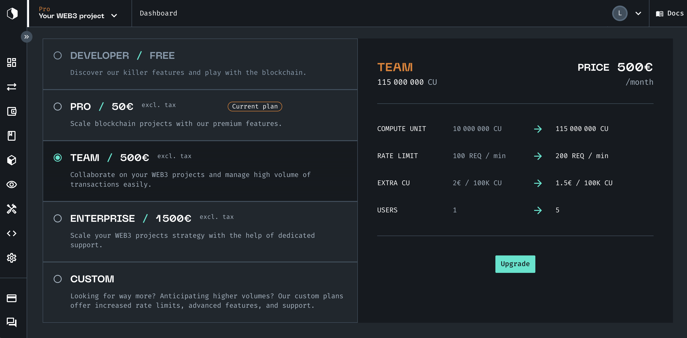
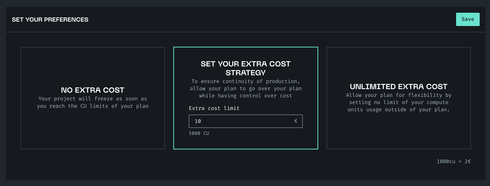

# Managing plans

Starton offers plans to cater to the diverse needs of its users, specifically designed to meet the different requirements of solo developers and teams. The first two plans are perfect for those who are looking for a platform to build their applications, providing a wide range of tools and services to make WEB3 development smooth and efficient.

In addition, Starton offers two plans designed to meet the needs of teams who require premium support and higher rate limits. These plans come with dedicated support from our team, who will work closely with users to ensure they get the most out of the platform. The higher rate limits offered by these plans allow teams to scale their applications to meet their growing needs.

You can subscribe to Starton plans on the Billing tab of [app.starton.com](https://app.starton.com/projects/default/billing)

> If you’re experiencing an exceptional increase in volume for your current month. You can also increase your limite when you run out of compute units. For more information, see **[pricing page](https://www.starton.io/pricing)**.

## Upgrading plans

An upgrade refers to any change in your plan that increases the capacity of your Starton project, such as rate limits, compute units, or users.

> Your new plan will take effect immediately after upgrading. You can use 100% of the capabilities of your new plan right away.
>

### Adding Extra units

To prevent your project from being frozen, you can allow your project to use extra units.

When you subscribe to Starton plans, you have access to a certain amount of compute units that you can use to run your applications. However, to avoid project freeze and ensure continuity of production, you can set a strategy allowing your plan to go over your compute unit limits.

When you choose to allow extra units to your plan, you can either set a limit for the amount of authorized extra units or allow for the unlimited overage. The former option ensures that you have control over the number of extra units being used, while the latter option allows for flexibility and the ability to handle unexpected spikes in usage.

## Unsubscribing from the plan

If you want to unsubscribe from Starton,  go to the Billing page of the Starton web application.

Your cancellation will take effect once your current plan ends. If you are billed every month, your plan will change at the end of the month.

When canceling your plan, your project is reverted to our free plan.

> Subscriptions in custom plans and annually billed plans cannot be canceled. Contact us.
>

### Reactivating subscription

Before the change is effective, if your subscription is canceled and you want to reactivate it, you can go to the Billing section of your account. There, a banner will notify you of all the details of your cancellation. You will be informed when the change will occur.

The **Reactivate subscription** button enables you change your mind and subscribe to your plan again.

> You cannot upgrade your plan if you cancel your subscription.

You are not considered actively subscribed to Starton services when your plan is cancelled. You still benefit from  your plan until cancellation is effective but you need an active subscription to upgrade your plan.
>

## Managing your billing

### Downloading invoices

To access your invoices, go to **Billing.**

You will first be able to consult the date of your next invoice as well as a link that will enable you to download all of your invoices to keep track of your payments. 

Additionally, having a record of all of your invoices can be helpful for financial reporting.

### Updating billing settings

You can upgrade your credit card information.
To access your billing settings, go to **Billing**.
There is a possibility for you to upgrade your credit card information.

**Related topics**

- [Discovering Starton compute units](/docs/Dashboard/compute-units)
- [Discovering the Dashboard](/docs/Dashboard/)