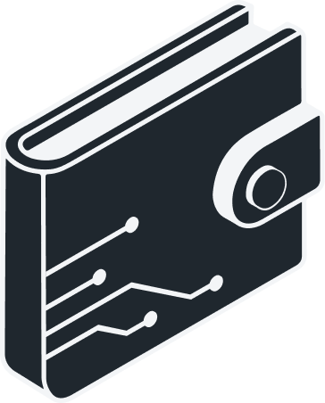

# About Wallets

To interact with blockchains, you need to sign transactions with a wallet to prove ownership over the associated address.

When deploying and interacting with Smart Contracts, you can use an external wallet to sign transactions manually. **Starton** supports **Metamask**.

:::caution

Transactions signed with a third party wallet will not be managed by our Relayer. 

:::

You can also use a wallet stored in a **Key Management System** (KMS).
A KMS enables you to sign transactions automatically.

For testing purposes, **Starton** provides you with a wallet stored on their own KMS. With it, you can discover all the features and start building.

:::caution

Do not use wallets on **Starton** KMS for production.

:::

For production projects, to maintain control over your wallets, you can either grant **Starton** access to a wallet on your KMS. For more advanced projects involving several wallets, grant **Starton** full access to your KMS.

**Related topics**

-   More on [Third-party wallets](connecting-an-external-wallet.md)
-   More on [Key Management Systems](understanding-key-management-systems.md)
-   More on [Granting Starton access on your KMS](connecting-aws-kms.md)
