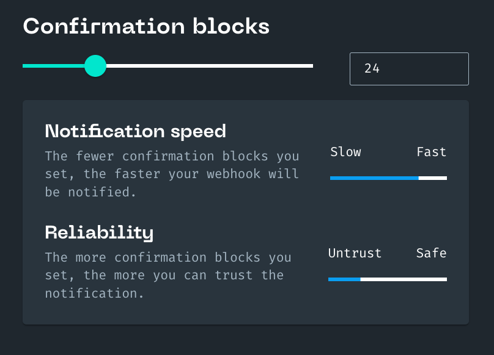

# Understanding confirmation blocks

As blockchain is a succession of blocks, when a transaction is published on blockchain nodes, there is a waiting time before it gets included in the next block.

When it finally is included in a block, the whole network is progressively becoming aware of the block and adopting it.
What sometimes happens is that several nodes spread different blocks in the network at the same time.
When it occurs, different histories of block successions exist.

For consistency purposes, only one of them can survive and persist.
This means that after some time, some histories may get reverted in favour of others, which implies that previously included transactions might not be included anymore in the newly adopted history.

Fortunately, the older a transaction has been included the more likely it is to persist forever.
The confirmation block value defines the number of validated blocks we should wait before considering a transaction as definitely accepted by the network.

Each network has a different block speed, and thus a different ideal value for the confirmation blocks.

|Network|Default confirmation blocks|
|---|---|
|Ethereum|
|ethereum-mainnet |12|
|ethereum-ropsten |12|
|ethereum-goerli |12|
|Binance|
|binance-mainnet  |48|
|binance-testnet  |48|
|Avalanche|
|avalanche-mainnet |80|
|avalanche-fuji |160|
|Polygon||
|polygon-mainnet|50|
|polygon-mumbai|50|
